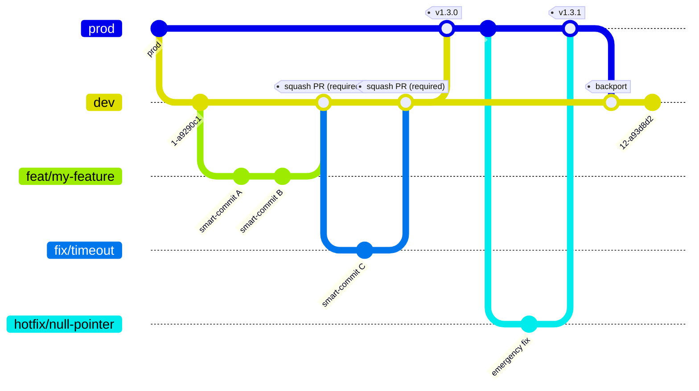
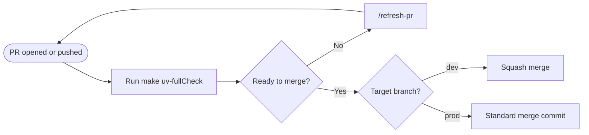
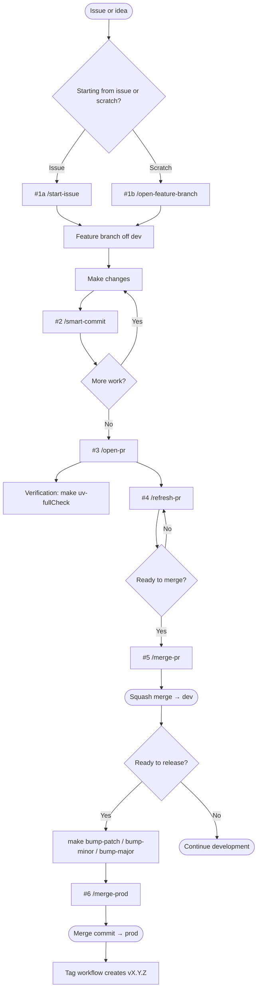
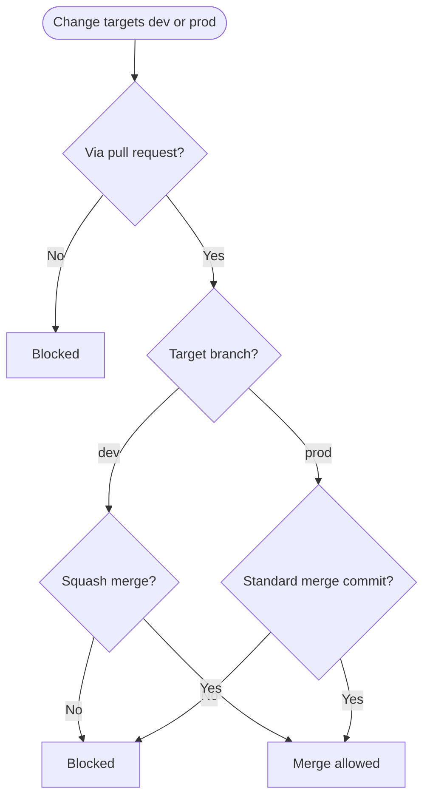
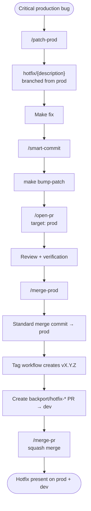

# Standard Python Repository Branching Strategy & Workflow

> [!NOTE]
> **Strict Merge Type Enforcement**
>
> - All merges **into `dev`** must use **Squash Merge**. This keeps the development trunk clean and linear.
> - All merges **into `prod`** (from `dev` or a hotfix branch) must use **Standard Merge Commit Only**. Squash merges are prohibited for releases to preserve exact release boundaries, audit trails, and enable precise cherry-picking.

## Sources of Truth

- The repository `Makefile` is authoritative for command names and command behavior.
- `github/pr-to-dev-ruleset.json` is authoritative for GitHub enforcement on `dev`.
- `github/pr-to-prod-ruleset.json` is authoritative for GitHub enforcement on `prod`.
- `gh-devops-helpers.sh --applyrules` creates or updates those rulesets on the current GitHub repository.

The active rulesets require pull requests, block branch deletion and non-fast-forward updates, and restrict the allowed merge method. They currently require zero approving reviews, do not require review-thread resolution, and do not configure required status checks.

## Branching Model

Two long-lived branches—`dev` (development trunk) and `prod` (production releases). All feature work branches off `dev` and merges back via squash. Releases promote `dev` → `prod` via standard merge commit. Hotfixes branch off `prod` and are backported to `dev`.



## Merge Policy

| Merge direction | Required strategy | Rationale |
| --- | --- | --- |
| Feature → `dev` | Squash merge | Keeps `dev` history clean and linear |
| `dev` → `prod` | Standard merge commit | Preserves exact release boundaries and audit trails |
| Hotfix → `prod` | Standard merge commit | Maintains visibility of critical production releases |
| Hotfix backport → `dev` | Squash merge | Keeps `dev` history clean while maintaining parity |

## Branch Naming

### Feature Branches

Feature branches are created from `origin/dev`:

```text
{type}/{short-description}
```

Supported types:

| Type | Usage |
| --- | --- |
| `feat` | New functionality |
| `fix` | Bug fix |
| `refactor` | Code improvement with no behavior change |
| `chore` | Maintenance, dependencies, or configuration |

#### Naming Rules

- Use lowercase.
- Use hyphens between words.
- Keep the description to approximately 50 characters or fewer.
- When associated with an issue, include the issue number in the description, such as `feat/issue-123-add-auth`.

Examples:

```text
feat/add-oauth
fix/timeout-handling
refactor/api-client
chore/update-dependencies
feat/issue-123-add-auth
```

### Hotfix Branches

Hotfixes are created from `origin/prod`:

```text
hotfix/{short-description}
```

Examples:

```text
hotfix/null-pointer
hotfix/payment-timeout
```

Hotfix branches:

- Are team-owned.
- Are reserved for genuine production emergencies.

### Backport Branches

After a hotfix reaches `prod`, create its backport branch using:

```text
backport/hotfix-{description}
```

Backport branches target `dev` and are squash-merged.

## Version Management

The repository follows Semantic Versioning:

```text
X.Y.Z
```

Where:

- `X` = major version
- `Y` = minor version
- `Z` = patch version

### Version Bump Commands

Choose exactly one:

```shell
make bump-patch
make bump-minor
make bump-major
```

The Makefile invokes `bumpversion --allow-dirty`, configured through `.bumpversion.cfg`.

### Versioning Rules

- The configured version must follow `X.Y.Z`.
- Version bumps create a commit and roll `HISTORY.md` into that commit.
- The versioning tool must use `tag = False`.
- Pushing a version change to `prod` triggers the repository's tag workflow.
- Bumping the version must not create a Git tag.

### Version Gate

Before a production release, the version in `pyproject.toml` should be strictly greater than the latest `prod` tag.

For example:

| Version source | Version | Result |
| --- | --- | --- |
| Latest `prod` tag | `v1.3.0` | Baseline |
| `pyproject.toml` | `1.3.1` | ✅ Allowed |
| `pyproject.toml` | `1.3.0` | ❌ Not release-ready |
| `pyproject.toml` | `1.2.9` | ❌ Not release-ready |

The current Makefile and branch rulesets do not compare the version against Git tags. This check is a release procedure, not an enforced gate.

## `HISTORY.md` Rollover

During development, changes accumulate under:

```markdown
## [Unreleased]
```

Running a Makefile version-bump target inserts a dated release section immediately below `## [Unreleased]` and includes it in the version-bump commit:

```markdown
## [X.Y.Z] - YYYY-MM-DD
```

Example:

```markdown
## [Unreleased]

## [1.3.0] - 2026-05-14

### Added

- Added OAuth authentication.
- Improved API timeout handling.
```

The Makefile uses `## [Unreleased]` as the changelog anchor. It does not independently validate release headings during a merge.

## Verification Commands

Use the Makefile's `uv-*` targets for repository verification:

| Check | Command or requirement |
| --- | --- |
| Lint | `make uv-lint` |
| Format and autofix | `make uv-format` |
| Tests on the default Python | `make uv-test` |
| Tests across configured Pythons | `make uv-test-all` |
| Typecheck | `make uv-typecheck` |

`uv-format` modifies files and is not a read-only formatting check. The supplied branch rulesets do not require status checks, so these commands are verification guidance rather than branch-protection gates.

The current CI workflow runs `make uv-lint`, `make uv-typecheck`, and `make uv-test-all`. It does not run `make uv-format` or a version-tag comparison.

### Local Verification

Run the combined local check target before pushing:

```shell
make uv-fullCheck
```

This target runs linting, typechecking, and tests on the default Python. It does not run `make uv-format`.

### Pull Request Flow



Verification is recommended, but the supplied rulesets do not make status checks a merge requirement.

## Standard Workflow

Slash commands describe the repository lifecycle interface. Their implementations are not present in this repository, so this document does not attribute enforcement to them when enforcement belongs to the Makefile, rulesets, or GitHub workflows. All commands are invoked manually; automation must not invoke them automatically.



### Step 1a — Start from an Issue

```text
/start-issue [issue#]
```

Examples:

```text
/start-issue 45
/start-issue org/repo#45
/start-issue
```

The wizard:

- Creates a feature branch from the latest `origin/dev`.
- Optionally links the branch to a repository issue.
- Prepares the working tree for development.

### Step 1b — Create a Feature Branch

```text
/open-feature-branch
```

This is the fast path when no issue exists. The command:

- Prompts for the branch type.
- Prompts for a short description.
- Creates the branch from the latest `origin/dev`.

### Step 2 — Commit Changes

```text
/smart-commit
```

`/smart-commit` analyzes staged and unstaged changes and groups them into logical commits using Conventional Commit messages.

Although PRs are squash-merged into `dev`, individual commits should still be clean and meaningful because they improve reviewability and debugging.

#### Commit Format

```text
<type>(<scope>): <description>

<extended body explaining intent, tradeoffs, and consequences>

Co-Authored-By: AI Assistant <noreply@example.com>
```

Example:

```text
fix(auth): handle expired access tokens

Refresh expired access tokens before retrying authenticated
requests. This prevents unnecessary 401 responses while
preserving the existing retry behavior.

Co-Authored-By: AI Assistant <noreply@example.com>
```

### Step 3 — Open the Pull Request

```text
/open-pr
```

The command:

- Pushes the feature branch.
- Opens a pull request.
- Targets `dev`.
- Automatically detects the branch base when possible.
- Generates the PR title and description.

### Step 4 — Refresh the Pull Request

```text
/refresh-pr
```

Use `/refresh-pr` to bring the PR to merge-ready state. The command may:

- Merge the latest `dev` changes when needed.
- Review bot and human comments.
- Address requested changes.
- Run linting and verification.
- Update the branch.
- Push changes.

### Step 5 — Merge Feature to `dev`

```text
/merge-pr
```

Merge the feature pull request into `dev` with a squash merge. The `dev` ruleset enforces this merge method.

```text
Feature branch
      │
      │ Squash merge
      ▼
     dev
```

Individual feature commits are replaced by one squash commit on `dev`.

### Step 6 — Release to `prod`

```text
/merge-prod
```

Use `/merge-prod` as the production release workflow interface. The source-backed release behavior is:

- Creates or reuses a PR from `dev` → `prod`.
- The version is bumped with `make bump-patch`, `make bump-minor`, or `make bump-major` before release.
- The bump target rolls `HISTORY.md` into the version commit.
- The `prod` ruleset permits only a standard merge commit.
- A version change pushed to `prod` triggers `tag-on-prod.yml` to create `vX.Y.Z`.
- Hotfix backporting is required policy, but it is not automated by the Makefile or supplied ruleset helper.

```text
dev
 │
 │ Standard merge commit
 ▼
prod
 │
 └── tag workflow creates vX.Y.Z
```

Squash merging a release into `prod` is prohibited.

### Step 7 — Summarize Open PRs

```text
/pr-summary
```

Generates a summary of open pull requests, including:

- Age
- CI status
- Review status
- Comments
- Merge readiness

Use this command for PR triage and release preparation.

## GitHub Ruleset Enforcement

The supplied rulesets enforce the following behavior:

| Setting | `dev` | `prod` |
| --- | --- | --- |
| Ruleset name | `into Dev` | `into Prod` |
| Pull request required | Yes | Yes |
| Allowed merge method | Squash only | Merge commit only |
| Branch deletion blocked | Yes | Yes |
| Non-fast-forward updates blocked | Yes | Yes |
| Required approving reviews | 0 | 0 |
| Required review-thread resolution | No | No |
| Required status checks | Not configured | Not configured |
| Bypass actors | None | None |



### Applying the Rulesets

Run the shared helper from the repository whose rulesets should be managed:

```shell
bash gh-devops-helpers.sh --applyrules
```

The helper requires an authenticated `gh` CLI and `jq`. It creates or updates rulesets by name from `github/pr-to-dev-ruleset.json` and `github/pr-to-prod-ruleset.json`, resolved relative to the script's directory.

```shell
bash gh-devops-helpers.sh --listrules
```

`--clearrules` deletes **every** ruleset on the current repository, not only the two managed by this branching strategy. Use it only when that full deletion is intended.

### Operational Checks Not Enforced by the Rulesets

Before merging, the team should still:

- Run the applicable Makefile verification targets.
- Confirm that failing tests have been resolved.
- Review the complete diff.
- For production releases, confirm the version is newer than the latest production tag.
- Confirm that `HISTORY.md` contains the expected version section.
- Obtain human review when the change warrants it.

These are workflow expectations. The supplied rulesets do not enforce approvals, status checks, check freshness, a version gate, or changelog validation.

## Safety Rules

### No Force Push

The rulesets' `non_fast_forward` rule blocks force pushes to `dev` and `prod`, and no bypass actors are configured. Do not use these commands against either protected branch:

```shell
git push --force
git push --force-with-lease
```

### Review Before Push

Before pushing:

- Review the complete diff.
- Confirm that the changes are intentional.
- Run the appropriate tests.
- Resolve failing tests before pushing.
- Never push blindly after an automated change.

### Avoid Fix-Revert-Fix Loops

Do not repeatedly patch and revert the same change. If a fix becomes unstable:

1. Stop.
2. Roll back cleanly.
3. Re-evaluate the root cause.
4. Redo the change cleanly.

## Hotfix Workflow

Hotfixes are reserved for critical production issues that cannot wait for the normal feature → `dev` → `prod` release cycle.



### `/patch-prod`

This command creates a hotfix branch from `prod`.

Because hotfixes bypass the normal development integration cycle, `/patch-prod` should display prominent warnings before proceeding.

Hotfix branches follow:

```text
hotfix/{short-description}
```

Example:

```text
hotfix/payment-timeout
```

### Hotfix Release

The hotfix PR targets `prod` and must use a standard merge commit.

Before merging, bump the release version—normally with `make bump-patch`—so the Makefile rolls `HISTORY.md` and the push to `prod` can trigger a new version tag.

The `prod` ruleset enforces this merge shape:

```text
hotfix branch
      │
      │ Standard merge commit
      ▼
     prod
```

After the hotfix merges:

- The `prod` ruleset ensures the production change uses a standard merge commit.
- The tag workflow creates `vX.Y.Z` when the version changed.
- Create a backport PR targeting `dev`; the supplied tooling does not automate this step.

### Hotfix Backport

The backport branch follows:

```text
backport/hotfix-{description}
```

The backport PR targets `dev` and must be squash-merged.

After the backport merges:

- Verify that `dev` contains the production fix.
- Verify that `dev`'s version is at least the production version.
- Re-bump `dev` if necessary.

`dev` must never permanently lack a change that exists on `prod`.

## Commit Quality Rules

### Conventional Commits

Use:

```text
type(scope): description
```

Rules:

- Use imperative mood.
- Use lowercase.
- Do not end the subject with a period.
- Keep the subject under 72 characters.

### Commit Bodies

Bodies are mandatory for non-trivial commits. Explain:

- Why the change was necessary.
- Important tradeoffs.
- Consequences or behavioral changes.

Do not merely describe what changed; the diff already shows that.

### Atomic Commits

Keep commits logically atomic. Examples:

- Database migrations should remain together when intermediate states would break the application.
- Independent changes should be split into separate commits.
- Code-generation refactors should be isolated.
- New utilities should be isolated.
- New packages should be isolated.

### Verification Evidence

When applicable, include verification evidence in commit messages or PR descriptions. For example:

```text
Verification: make uv-fullCheck passes.
```

Do not claim verification that was not actually performed.

## Complete Standard Workflow

```text
/start-issue [issue#]

# or

/open-feature-branch

# Make changes
/smart-commit

# Push + open PR targeting dev
/open-pr

# Run lint, typecheck, and default-Python tests
make uv-fullCheck

# Update branch and address comments
/refresh-pr

# Squash merge → dev
/merge-pr

# Continue accumulating features on dev
# Bump version and roll HISTORY.md before release; choose one
make bump-patch
# make bump-minor
# make bump-major

# Standard merge commit → prod
/merge-prod

# Push to prod triggers the vX.Y.Z tag workflow
```

## Emergency Hotfix Workflow

```text
/patch-prod

# Branch from prod
# Make critical fix
/smart-commit

# Target prod
/open-pr

# Standard merge commit → prod
# Push to prod triggers the vX.Y.Z tag workflow
/merge-prod

# Create a backport PR → dev
# Squash merge backport → dev
/merge-pr
```

## TL;DR

### Normal Development

```text
Issue / idea
     │
     ├── /start-issue [issue#]
     │   or
     └── /open-feature-branch
             │
             ▼
       Feature branch
             │
             ▼
       Make changes
             │
             ▼
       /smart-commit
             │
             ▼
         /open-pr
             │
             ▼
 Verification + optional review
             │
             ▼
       /refresh-pr
             │
             ▼
        /merge-pr
             │
             │ Squash merge
             ▼
            dev
             │
             ▼
       /merge-prod
             │
             │ Standard merge commit
             ▼
           prod
             │
             ▼
   Tag workflow: vX.Y.Z
```

### Emergency Hotfix

```text
Critical production bug
           │
           ▼
     /patch-prod
           │
           ▼
 hotfix/{description}
           │
           ▼
    /smart-commit
           │
           ▼
       /open-pr
           │ targets prod
           ▼
     /merge-prod
           │ Standard merge commit
           ▼
         prod
           │
           ├── Tag workflow creates vX.Y.Z
           │
           ▼
    Create backport PR
           │
           ▼
      /merge-pr
           │ Squash merge
           ▼
          dev
```

## Policy Summary

The supplied GitHub rulesets enforce:

- Changes to `dev` and `prod` must arrive through pull requests.
- Merges into `dev` are squash-only.
- Merges into `prod` use standard merge commits only.
- Deletion and non-fast-forward updates of `dev` and `prod` are blocked.
- No bypass actors are configured.

The following are repository workflow expectations but are not enforced by the supplied rulesets:

- Feature branches originate from `dev`.
- Hotfix branches originate from `prod`.
- Every production hotfix is backported to `dev`.
- The production version is newer than the latest `prod` tag.
- `HISTORY.md` contains the expected versioned release heading.
- Applicable Makefile verification targets pass before merging.
- Human review is obtained when warranted.

> [!IMPORTANT]
> There are no exceptions to the merge-type policy:
>
> - `dev` ← feature/backport: **Squash Merge**
> - `prod` ← `dev`/hotfix: **Standard Merge Commit**
